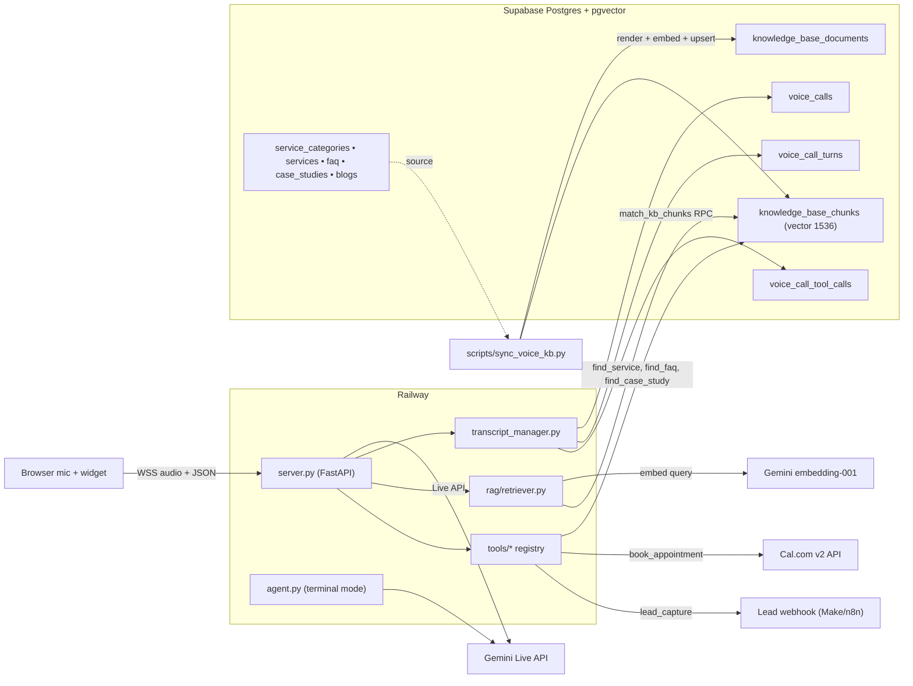

# Maya — Voice Agent Architecture

> Deep-dive into how the DigiiMark voice agent works end-to-end after the
> Supabase migration. For installation and usage, see [`README.md`](./README.md).

---

## TL;DR

**Maya** is a real-time, speech-to-speech voice agent that talks to website
visitors over a browser microphone, answers their questions using a Supabase
knowledge base (RAG via pgvector), books discovery calls on DigiiMark's
Cal.com calendar, and saves every transcript to Supabase.

The core loop is:

```
Browser mic  →  WebSocket  →  FastAPI (server.py)  →  Gemini Live API
                                       ↓
                                 Supabase (pgvector)
                                       ↓
                                  Tools (book_appointment,
                                         find_service, find_case_study,
                                         find_faq, lead_capture)
                                       ↓
Browser speaker  ←  WebSocket  ←  FastAPI  ←  Gemini audio response
```

Everything Maya needs — knowledge base, embeddings, call transcripts, tool
data — lives in Supabase. The voice agent process itself is **stateless** and
Railway-ready (single Dockerfile, zero persistent disk required).

| What | Where |
|------|-------|
| Company knowledge (overview, pricing) | Markdown in `knowledge_base/` → synced to Supabase |
| Live content (services, FAQs, case studies, blogs) | Existing Supabase tables → synced into KB tables |
| Vector embeddings | `knowledge_base_chunks.embedding` (pgvector, 1536d) |
| Call transcripts | `voice_calls` + `voice_call_turns` + `voice_call_tool_calls` |
| Bookings | Cal.com (via API) |
| Lead captures | Webhook (Make / n8n / Zapier) |

---

## 1. The Two Runtime Modes

There are two separate ways to talk to Maya. They share the same RAG, tools,
config, transcript manager, and system prompt — only the audio I/O differs.

### Mode A — Web (browser) — [`server.py`](./server.py) (production)

The production path used by the marketing site. FastAPI app with a WebSocket
endpoint and a static HTML/JS frontend in [`web/`](./web).

```
voice_agent/
├── server.py              FastAPI + WebSocket + Gemini Live bridge
└── web/
    ├── index.html          UI with orb + transcript panel
    └── static/
        └── audio-processor.js  AudioWorklet that converts mic → 16-bit PCM
```

Run locally:
```bash
python server.py        # uses $PORT (Railway) or VOICE_WEB_PORT (default 8001)
```

### Mode B — Terminal (local PyAudio) — [`main.py`](./main.py) + [`agent.py`](./agent.py)

Standalone CLI using your laptop's mic and speakers via PyAudio. Useful for
local testing without a browser.

```bash
python main.py
```

Requires PyAudio to be installed locally (not in the production image) —
see [`requirements.txt`](./requirements.txt).

---

## 2. Component Map



---

## 3. End-to-End Conversation Flow

Step-by-step what happens when a visitor clicks **Start Call**:

### 3.1 Boot (one-time, when `server.py` starts)

1. [`config.py`](./config.py) loads `.env`, validates `GEMINI_API_KEY` + `SUPABASE_*`, and sets defaults.
2. [`supabase_client.get_client()`](./supabase_client.py) is lazily initialised on first use — no heavy boot step.
3. A health probe counts `knowledge_base_chunks` so `/api/health` can report it.
4. `tool_registry` (built in [`tools/__init__.py`](./tools/__init__.py)) is ready with `book_appointment_tool`, `lead_capture_tool`, `find_service`, `find_case_study`, `find_faq`.
5. FastAPI starts; static files are mounted; `/` serves `web/index.html`.

No file watcher, no FAISS build — the agent is instant-ready.

### 3.2 Click "Start Call" in the browser

1. `getUserMedia({ sampleRate: 16000 })` → `AudioContext` at 16 kHz.
2. `AudioWorkletNode('pcm-processor')` converts Float32 mic frames to Int16 PCM on its own thread.
3. A WebSocket opens to `/ws/voice`; every PCM `ArrayBuffer` is forwarded.

### 3.3 WebSocket handshake on the server

In [`server.py`](./server.py) `voice_ws()`:

1. [`TranscriptManager.start_call()`](./transcript_manager.py) generates an 8-char hex `call_id` and **inserts a row into `voice_calls`** right away (so the call appears in dashboards while still live). Caller headers (user-agent, referrer, forwarded-for) are attached as `caller_metadata`.
2. `build_prompt()` runs `retrieve_context_for_turn([])` — which currently returns `""` (no history yet), then formats `SYSTEM_PROMPT_TEMPLATE` with `agent_name=Maya` and the (empty) RAG context.
3. `LiveConnectConfig` is assembled with `response_modalities=["AUDIO"]`, `AGENT_VOICE`, system instruction, and tool declarations.
4. `client.aio.live.connect(model=LIVE_MODEL, config=...)` opens the bidirectional stream.

### 3.4 The two concurrent tasks

```python
send_task = asyncio.create_task(forward_audio())   # browser → Gemini
recv_task = asyncio.create_task(receive_gemini())  # Gemini → browser
await asyncio.wait([send_task, recv_task], return_when=FIRST_COMPLETED)
```

**`forward_audio()`** reads frames from the WebSocket. Binary → `Blob(audio/pcm)` → `session.send_realtime_input`. JSON `{"action": "end_call"}` exits the loop.

**`receive_gemini()`** wraps Gemini's per-turn `session.receive()` async iterator in a `while not should_stop:` loop so subsequent turns keep flowing. For each response:

| Response field | Action |
|---|---|
| `response.data` | 24 kHz PCM audio → `ws.send_bytes(...)` |
| `response.text` | Maya's reply → `tm.add_turn(call_id, "assistant", ...)` + JSON push |
| `server_content.input_transcription.text` | Caller speech (server VAD) → `tm.add_turn("user", ...)` + JSON push |
| `response.tool_call` | `tool_registry.execute(...)` + `tm.add_tool_call(...)` + send `FunctionResponse` back to Gemini |
| `response.go_away` | Server shutting us down → break |

### 3.5 The browser plays audio

`ws.onmessage` differentiates binary vs text:

- **Binary** PCM chunks → `playQueue` → `drainPlayQueue()` converts Int16 → Float32, wraps each in a 24 kHz `AudioBuffer`, plays sequentially with `source.onended` gating.
- **JSON** → transcript pane (`transcript`), tool-call card (`tool_call`), or status banner.

### 3.6 Hang up

1. Browser sends `{"type":"control","action":"end_call"}`.
2. `forward_audio()` exits, `asyncio.wait(...)` resolves.
3. `_infer_topics(history)` does keyword tagging.
4. [`TranscriptManager.end_call()`](./transcript_manager.py):
   - Bulk-inserts all buffered turns into `voice_call_turns`.
   - Bulk-inserts all buffered tool invocations into `voice_call_tool_calls`.
   - Updates the `voice_calls` row with `ended_at`, `duration_seconds`, `topics`, `tools_used`, `turn_count`.

---

## 4. Supabase Schema

Created by [`scripts/voice-agent-supabase-migration.sql`](../scripts/voice-agent-supabase-migration.sql).

### 4.1 Knowledge base

```text
knowledge_base_documents
  id              uuid PK
  title           text
  category        text         -- company | pricing | service_category | service | faq | case_study | blog
  content         text         -- canonical markdown rendered by the sync script
  source_type     'manual' | 'synced'
  source_table    text         -- e.g. 'services', 'faq', 'case_studies', 'voice_agent_kb'
  source_id       uuid         -- the row this KB doc mirrors (soft FK)
  metadata        jsonb
  is_active       boolean
  content_hash    text         -- sha256(content) — drives incremental re-embedding
  updated_at      timestamptz
  created_at      timestamptz
  UNIQUE (source_table, source_id)  -- partial index; manual docs allowed to stack

knowledge_base_chunks
  id              uuid PK
  document_id     uuid FK → knowledge_base_documents.id ON DELETE CASCADE
  chunk_index     int
  content         text
  embedding       vector(1536)
  created_at      timestamptz
  INDEX hnsw (embedding vector_cosine_ops)
```

### 4.2 `match_kb_chunks` RPC

```sql
match_kb_chunks (
  query_embedding  vector(1536),
  match_count      int DEFAULT 4,
  filter_category  text DEFAULT NULL
) RETURNS (chunk_id, document_id, document_title, document_category, content, similarity)
```

Returns top-N chunks by cosine similarity; joins `knowledge_base_documents` to
filter by category and expose the source document's title.

### 4.3 Transcripts

```text
voice_calls             one row per call (agent_name, voice_name, model, topics[], tools_used[], turn_count, caller_metadata jsonb, ...)
voice_call_turns        one row per turn (role, content, turn_index) FK → voice_calls.call_id
voice_call_tool_calls   one row per tool (tool_name, args jsonb, result jsonb)
```

RLS denies anon reads on all three (PII). The voice agent uses the service role key so it bypasses RLS.

### 4.4 FAQ

```text
faq (question, answer, sort_order, is_active, linked_service_id, linked_case_study_id)
```

Public RLS read policy (so the marketing site can fetch it with the anon key).

---

## 5. Embeddings — Why 1536 via Matryoshka

| Decision | Rationale |
|---|---|
| **Model:** `gemini-embedding-001` | Current Gemini embedding model, supports `output_dimensionality` via Matryoshka Representation Learning. |
| **Dimension:** 1536 | Fits pgvector's native HNSW index limit (2000d) without a `halfvec` cast. Halves storage vs 3072. Matches OpenAI `text-embedding-3-small` for portability. Negligible recall loss vs 3072 for this corpus size. |
| **Task types:** `RETRIEVAL_QUERY` vs `RETRIEVAL_DOCUMENT` | Gemini applies different embedding strategies for each — measurably better retrieval quality than a single generic embedding. |
| **Index:** HNSW `vector_cosine_ops` | Approximate nearest neighbour, sub-millisecond at current scale, easy to tune later. |

If accuracy ever becomes the bottleneck, swapping to `halfvec(3072)` is a one-line change in the migration SQL plus a re-embed — the rest of the pipeline doesn't care.

---

## 6. The Sync Pipeline

The knowledge base is built **from existing Supabase content + local markdown**
by one idempotent script: [`scripts/sync_voice_kb.py`](./scripts/sync_voice_kb.py).

Collectors:

| Key | Source | Category | Title | Content |
|---|---|---|---|---|
| `manual` | `voice_agent/knowledge_base/*.md` | `company` / `pricing` | First H1 | Raw markdown |
| `service_categories` | `service_categories` table | `service_category` | `name` | Hero + process + target industries flattened |
| `services` | `services` table | `service` | `name` | Hero + service_details + methodology + what_we_provide JSON rendered |
| `faq` | `faq` table | `faq` | `FAQ: {question}` | `Q: … / A: …` |
| `case_studies` | `case_studies` (published) | `case_study` | `h1_title` | Brief + challenges + results |
| `blogs` | `blogs` (top 20 published) | `blog` | `title` | Excerpt + first ~500 words of body |

Algorithm per document:

1. Render canonical markdown.
2. `sha256(markdown)` → `content_hash`.
3. **Upsert** `knowledge_base_documents` by `(source_table, source_id)`.
4. If `content_hash` changed OR no chunks exist: delete old chunks, chunk (500 words / 50 overlap), embed with task_type=RETRIEVAL_DOCUMENT, bulk insert new chunks.

Run modes:
```bash
python scripts/sync_voice_kb.py                     # full sync
python scripts/sync_voice_kb.py --only services,faq # partial
python scripts/sync_voice_kb.py --force             # re-embed everything
```

The sync is **cheap after the first run**: unchanged documents skip embedding entirely (hash match).

---

## 7. Tool Calling

Tools turn natural-language intents into real-world side effects.

### 7.1 Registry (unchanged)

[`tools/base.py`](./tools/base.py) defines `BaseTool` (abstract) and `ToolRegistry`. `ToolRegistry.gemini_tools_config()` returns the shape Gemini Live expects; it's passed in `LiveConnectConfig(tools=...)` so Gemini knows all function signatures from the first turn.

### 7.2 Available tools

| Tool | Purpose | Backing |
|------|---------|---------|
| [`book_appointment_tool`](./tools/book_appointment_tool.py) | Book a discovery call | Cal.com v2 API (`POST /v2/bookings`) |
| [`lead_capture_tool`](./tools/lead_capture_tool.py) | Capture a lead for follow-up | Generic webhook (`LEAD_CAPTURE_WEBHOOK_URL`) |
| [`find_service`](./tools/content_lookup_tool.py) | Semantic lookup over DigiiMark services | `match_kb_chunks` filtered to `service` → enrich with `services` table |
| [`find_case_study`](./tools/content_lookup_tool.py) | Find published case studies by industry / service | Direct `case_studies` filter + optional semantic rerank |
| [`find_faq`](./tools/content_lookup_tool.py) | Semantic lookup over `faq` rows | `match_kb_chunks` filtered to `faq` → enrich with `faq` table |

### 7.3 Booking flow (Cal.com)

[`book_appointment_tool.py`](./tools/book_appointment_tool.py):

1. Parses loose natural-language date/time ("next Tuesday at 3pm", "tomorrow at 10:30", "2026-04-20 15:00") into ISO-8601 UTC using `zoneinfo`.
2. POSTs to `${CALCOM_API_BASE}/bookings` with the event type ID, attendee, and metadata `{source:"voice_agent", call_id, reason}`.
3. Returns `{result:"success", message, booking_id, start}` — Maya reads the message aloud.
4. If `CALCOM_API_KEY` is missing, the tool returns `{result:"simulated", ...}` so local dev isn't blocked.

### 7.4 Content lookups

`find_service` illustrates the pattern used by all three semantic tools:

1. Embed the query (`RETRIEVAL_QUERY` task type).
2. Call `match_kb_chunks` with the right category filter.
3. De-duplicate by `document_id` (multiple chunks of the same row).
4. Fetch the real source row (e.g. from `services`) for fresh fields + URL building.
5. Return a compact dict with a `url` so Maya can say "I'll send you a link".

---

## 8. File-by-File Reference

| File | Purpose |
|------|---------|
| [`server.py`](./server.py) | FastAPI app + `/ws/voice` WebSocket bridge to Gemini Live |
| [`main.py`](./main.py) | Terminal-mode entry (CLI flags, `--sync-kb`, `--list-calls`) |
| [`agent.py`](./agent.py) | Terminal-mode PyAudio + Gemini Live loop |
| [`config.py`](./config.py) | All settings + `SYSTEM_PROMPT_TEMPLATE` + `OPENING_TRIGGER` |
| [`supabase_client.py`](./supabase_client.py) | Singleton Supabase service-role client |
| [`transcript_manager.py`](./transcript_manager.py) | `voice_calls` / `voice_call_turns` / `voice_call_tool_calls` writer |
| [`rag/embedder.py`](./rag/embedder.py) | `gemini-embedding-001` at 1536d w/ task types |
| [`rag/retriever.py`](./rag/retriever.py) | `match_kb_chunks` RPC wrapper → formatted context block |
| [`tools/base.py`](./tools/base.py) | `BaseTool` + `ToolRegistry` |
| [`tools/book_appointment_tool.py`](./tools/book_appointment_tool.py) | Cal.com v2 booking |
| [`tools/lead_capture_tool.py`](./tools/lead_capture_tool.py) | Webhook-based lead capture |
| [`tools/content_lookup_tool.py`](./tools/content_lookup_tool.py) | `find_service` / `find_case_study` / `find_faq` |
| [`scripts/sync_voice_kb.py`](./scripts/sync_voice_kb.py) | Render Supabase content → KB chunks, incremental embedding |
| [`web/index.html`](./web/index.html) | Voice console (orb, transcript, controls) |
| [`web/static/audio-processor.js`](./web/static/audio-processor.js) | AudioWorklet: mic Float32 → Int16 PCM |
| [`Dockerfile`](./Dockerfile) | Production container image for Railway |
| [`railway.json`](./railway.json) | Railway build + health config |
| [`requirements.txt`](./requirements.txt) | Python deps (web/server mode) |
| [`knowledge_base/*.md`](./knowledge_base) | Manual company docs that feed the sync script |

---

## 9. Environment Variables

All documented in [`.env.example`](./.env.example). Condensed:

| Variable | Required? | Purpose |
|----------|-----------|---------|
| `GEMINI_API_KEY` | yes | Gemini Live + embedding APIs |
| `SUPABASE_URL` | yes | Supabase project URL |
| `SUPABASE_SERVICE_ROLE_KEY` | yes | RAG + transcripts + content tools |
| `CALCOM_API_KEY` | for booking | Cal.com API (simulated otherwise) |
| `CALCOM_EVENT_TYPE_ID` | for booking | Numeric event type ID |
| `LEAD_CAPTURE_WEBHOOK_URL` | for leads | Make / n8n / Zapier |
| `SITE_BASE_URL` | no | Defaults to `https://digiimark.com`; used for shareable URLs |
| `LIVE_MODEL` | no | Override Gemini Live model |
| `AGENT_NAME`, `AGENT_VOICE` | no | Persona + TTS voice |
| `PORT` | no | Railway injects automatically |
| `CORS_ORIGINS` | no | Comma-separated allowlist |
| `LOG_LEVEL` | no | `DEBUG` for verbose |

---

## 10. Mental Model — One Sentence Per Layer

- **Audio I/O:** Browser's AudioWorklet streams 16 kHz PCM in; a 24 kHz queue plays Gemini's reply out, chunk-by-chunk, without overlap.
- **Transport:** A single WebSocket carries binary audio in both directions plus JSON for transcripts, tool calls, and status.
- **Model:** Gemini Live does VAD, ASR, LLM, and TTS in one bidirectional session — Maya is the persona configured by the system prompt.
- **Memory:** Per-call history lives in a Python list; company knowledge lives as 1536d pgvector embeddings in `knowledge_base_chunks`.
- **Knowledge sync:** Edit the relevant Supabase row (or drop a markdown file) → run `python scripts/sync_voice_kb.py` → Maya quotes it on the next call.
- **Actions:** Tools are JSON-Schema-described Python classes; Gemini decides when to call them; Cal.com and webhooks fire downstream; results are spoken back.
- **Persistence:** Every call lives in `voice_calls` + `voice_call_turns` + `voice_call_tool_calls` — fully queryable via SQL.
- **Deploy:** One Railway service built from [`Dockerfile`](./Dockerfile); stateless; scales horizontally.

That's the whole agent.

---

## 11. Things to Know Before Editing

- **Personality changes** → edit `SYSTEM_PROMPT_TEMPLATE` in [`config.py`](./config.py). Nothing else references prompts directly.
- **New tools** → subclass `BaseTool`, register in [`tools/__init__.py`](./tools/__init__.py). No changes to the agent loop needed.
- **Embedding dimension** — if you ever move off 1536, you MUST:
  1. Change `EMBEDDING_DIMENSION` in [`config.py`](./config.py).
  2. Update the `vector(N)` column and the `match_kb_chunks` RPC signature in SQL.
  3. Re-embed everything with `python scripts/sync_voice_kb.py --force`.
- **Knowledge base updates** — always run the sync script after editing. The script is idempotent and only re-embeds changed docs (hash-based), so it's cheap.
- **Schema drift** — the migration SQL is defensive (`IF NOT EXISTS`, FK guards), but if `testimonials` / `case_studies` already exist in production with older columns, review before running.
- **No CSRF, no auth on `/ws/voice`** — anyone who can reach the Railway URL can talk to Gemini on your dime. Put a token / signed session behind `CORS_ORIGINS` + a token-minting endpoint before opening to the internet.
- **Call transcripts contain PII** — `voice_calls` has RLS denying anon reads. Any admin UI must use the service role key via a server-side route.
